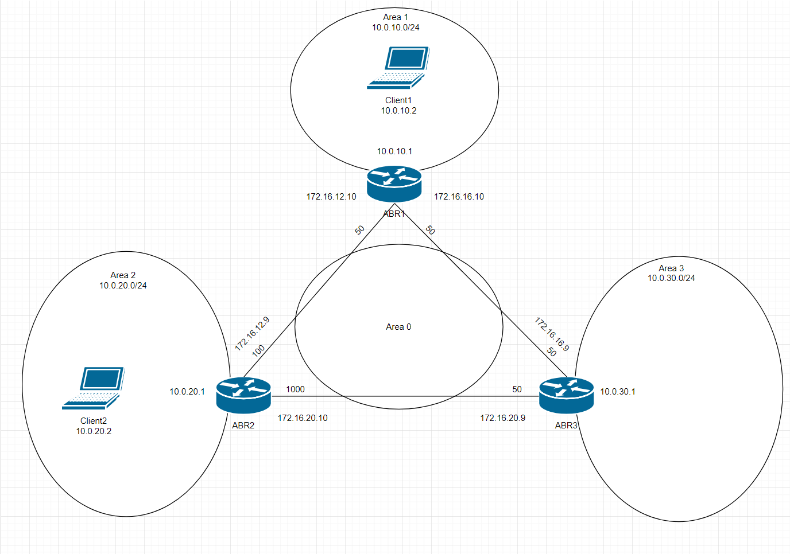

# OSPF

Схема сети:



1. Виртуалки и OSPF поднимаются автоматически по команде `vagrant up`

2. После инициализации изображен ассиметричный роутинг от client2 до abr3:

client2:

```bash
[vagrant@client2 ~]$ traceroute 10.0.30.1
traceroute to 10.0.30.1 (10.0.30.1), 30 hops max, 60 byte packets
 1  gateway (10.0.20.1)  0.742 ms  0.444 ms  0.245 ms
 2  172.16.12.10 (172.16.12.10)  0.934 ms  0.687 ms  1.208 ms
 3  10.0.30.1 (10.0.30.1)  1.284 ms  1.126 ms  1.644 ms
```

abr3:

```bash
[vagrant@abr3 ~]$ traceroute 10.0.20.2
traceroute to 10.0.20.2 (10.0.20.2), 30 hops max, 60 byte packets
 1  172.16.20.10 (172.16.20.10)  0.567 ms  0.352 ms  0.203 ms
 2  10.0.20.2 (10.0.20.2)  2.004 ms  1.986 ms  1.806 ms
```

3. Для создания симметричного роутинга необходимо изменить вес на интерфейсе eth3 на abr3 командами:

```bash
[vagrant@abr3 ~]$ sudo su
[root@abr3 vagrant]# vtysh

Hello, this is Quagga (version 0.99.22.4).
Copyright 1996-2005 Kunihiro Ishiguro, et al.

abr3# conf t
abr3(config)# interface  eth3
abr3(config-if)# no ip ospf  cost 50
abr3(config-if)# ip ospf cost 1000
abr3(config-if)# ^Z
abr3# write
Building Configuration...
Configuration saved to /etc/quagga/zebra.conf
Configuration saved to /etc/quagga/ospfd.conf
[OK]
abr3# exit
```

И убедиться что маршрут стал симметричным:

```bash
[root@abr3 vagrant]# traceroute 10.0.20.2
traceroute to 10.0.20.2 (10.0.20.2), 30 hops max, 60 byte packets
 1  172.16.16.10 (172.16.16.10)  0.829 ms  0.215 ms  0.275 ms
 2  172.16.12.9 (172.16.12.9)  3.293 ms  3.168 ms  3.003 ms
 3  10.0.20.2 (10.0.20.2)  3.711 ms  3.713 ms  3.539 ms
```
